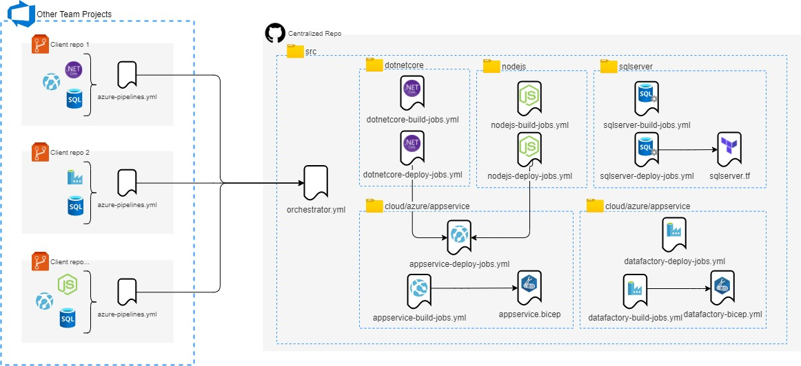

# UDP - Universal Delivery Pipeline

## High Level Architecture



## Setup Local debug

There are two ways to configure your debug environment. The first and recommended is to add the script execution in your PowerShell profile. The second is to run the script manually, in this case time you create a new session in the terminal you need to run the script.


### Powershell Profile

To setup your local environment add the lines below in your $profile in your VSCode powershell session.

To do it open your vscode, and initiate a debug session (https://code.visualstudio.com/docs/editor/debugging). 

In the Powershell Integrated Console type `code $profile`

```
Set-Item -Path Env:personalAccessToken -Value "<your azure devops personal access token>"

.\src\azureDevOps\pipeline\setup.localTests.ps1
```

### Running manually

Run the script below in your PowerShell session:

```
.\src\azureDevOps\pipeline\setup.localTests.ps1
```

It will request your Azure DevOps Personal Access Token.